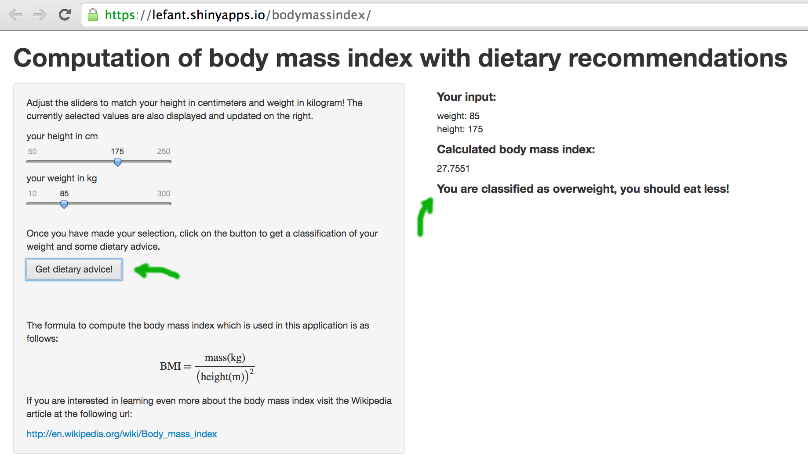

# Computation of body mass index
### with dietary recommendations!

- - -

<small>created by [Fabian Linzberger](http://e.lefant.net/) / [@lefant](http://twitter.com/lefant) </small>

---

### What is the body mass index (BMI)

- - -

<q>a measure of relative weight based on an individual's mass and height.</q> - Wikipedia

- - -

The BMI is used in a wide variety of contexts as a simple method to
assess how much an individual's body weight departs from what is
normal or desirable for a person of his or her height.

---

Stastistical BMI data is readily available for comparison

```{r eval = TRUE, echo = TRUE, fig.height=5, fig.width=9}
library(reshape2)
library(ggplot2)
df <- read.csv("UnitedStatesofAmerica.csv")[c(40:43), c(1:6)]
colnames(df)[1] <- "year"
ggplot(data=melt(df, id = "year"), aes(x=year, y=value, fill=variable)) +
  geom_bar(stat="identity", position=position_dodge()) +
  xlab("Year") + ylab("Percentage of adults in the US") +
  ggtitle("Distribution of BMI classes over time")
```

<small>Source: http://apps.who.int/bmi/index.jsp</small>

---

### engaging the user



online demo: https://lefant.shinyapps.io/bodymassindex/

---

### Future improvements:
- improve usability by allowing choice of metric or imperial units
- specialize recommendations per gender

- - -

### Source code is available:
- https://github.com/lefant/bodymassindex/

- - -

### Further reading:
- http://en.wikipedia.org/wiki/Body_mass_index
- http://www.who.int/mediacentre/factsheets/fs311/en/
